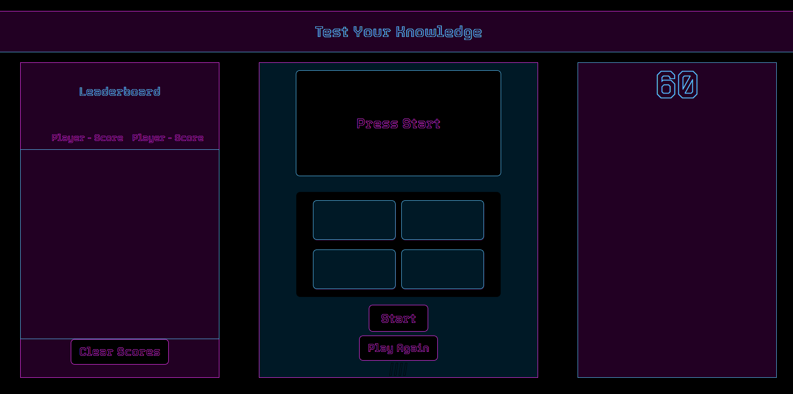

# Week 3 DU bootcamp challenge

## Focus on JSON local storage usage and event listeners

# JavaScript Quiz

## Follow the instructions to play

## How

### The js file was my 2nd attempt as the first one got very muddled with variables that led no where as I would forget the previous day's work. The second file suffered from that a bit as well, but with some tutoring help, I was able to get it all working. I utilized JSON, event listeners, and arrays mainly for this challenge.

### Have fun

https://jthornex.github.io/04-challenge-bootcamp/

